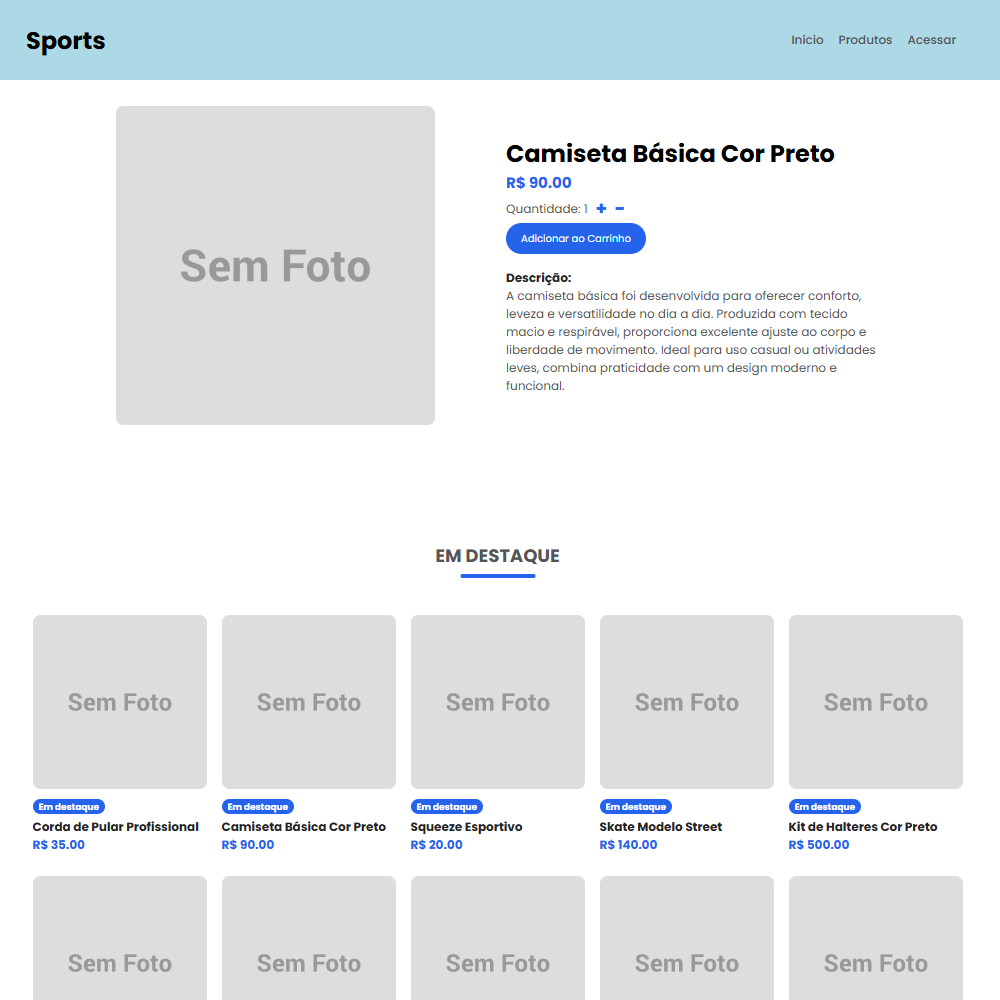
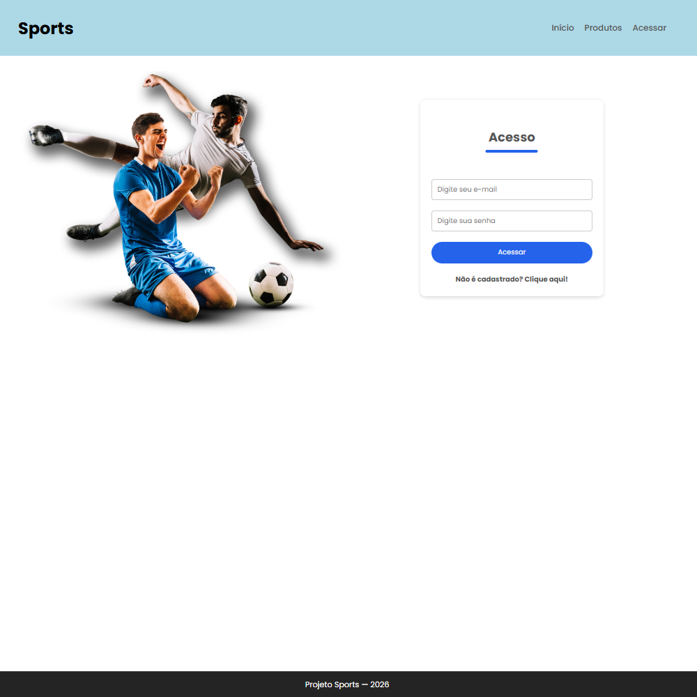
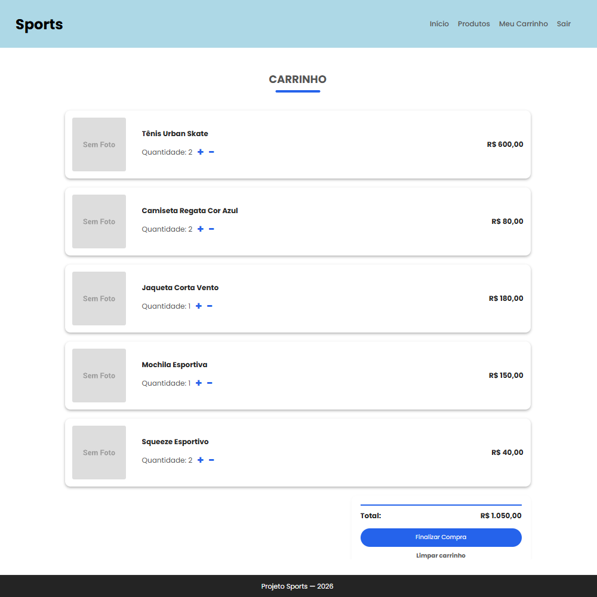

# Sports

Sports é uma aplicação web Full Stack construída em React, um e-commerce de artigos esportivos inicialmente desenvolvido em 2020 como trabalho de conclusão de curso do ensino superior. Esta é uma versão completamente reconstruída, que mantém a premissa original do projeto, mas com foco na atualização do stack tecnológico.

<p align="center">
  
  
  
  
</p>

## Tecnologias utilizadas:

- React
- HTML
- CSS
- JavaScript
- Node
- Vite
- JSON (produtos)
- Prisma ORM
- MongoDB
- TanStack React Query
- Axios
- React Router
- Express.js
- JWT (token de sessão)
- Bcrypt (criptografia de senhas)

## Estrutura do projeto:

### Client (front-end):
```bash
client/
├── src/
│   ├── assets/
│   │   └── img
│   ├── components/
│   │   ├── Auth
│   │   ├── Cart
│   │   ├── Footer
│   │   ├── Navbar
│   │   ├── ProductDetail
│   │   └── ProductGrid
│   ├── contexts/
│   │   ├── Auth
│   │   │   ├── AuthContext
│   │   │   └── AuthProvider
│   │   └── Cart
│   │       ├── CartContext
│   │       └── CartProvider
│   ├── hooks/
│   │   └── useProducts.js
│   ├── pages/
│   │   ├── Access
│   │   ├── Home
│   │   ├── Product
│   │   ├── Products
│   │   └── Shopping
│   ├── services/
│   │   └── api.js
│   ├── utils/
│   │   ├── PrivateRoutes
│   │   └── PublicRoutes
├── index.html
└── package.json
```
### Server (back-end):
```bash
server/
├── data/
│   └── products.json
├── middlewares/
│   └── authMiddleware.js
├── prisma/
│   └── schema.prisma
├── routes/
│   └── authRoutes.js
├── .env
├── package.json
└── server.js
```

## Execução do projeto:

### Clone o repositório:
```bash
git clone https://github.com/vinicyuscueto/sports
```

### Server:

#### Abrir diretório:
```bash
cd server
```

#### Construção do arquivo .env:
```bash
cp .env.example .env
```

#### Configuração das variáveis de ambiente (.env):
```bash
DATABASE_URL="mongodb+srv://<username>:<password>@<cluster>.mongodb.net/<database>?appName=<name>"
JWT_SECRET=<key>
```

#### Instalação de dependências:
```bash
npm install
```

#### Execução do projeto:
```bash
node server.js
```

### Client:

#### Abrir diretório:
```bash
cd client
```

#### Instalação de dependências:
```bash
npm install
```

#### Inicialização do Prisma:
```bash
npx prisma generate
```

#### Construção do schema no banco de dados:
```bash
npx prisma db push
```

#### Execução do projeto:
```bash
npm run dev
```